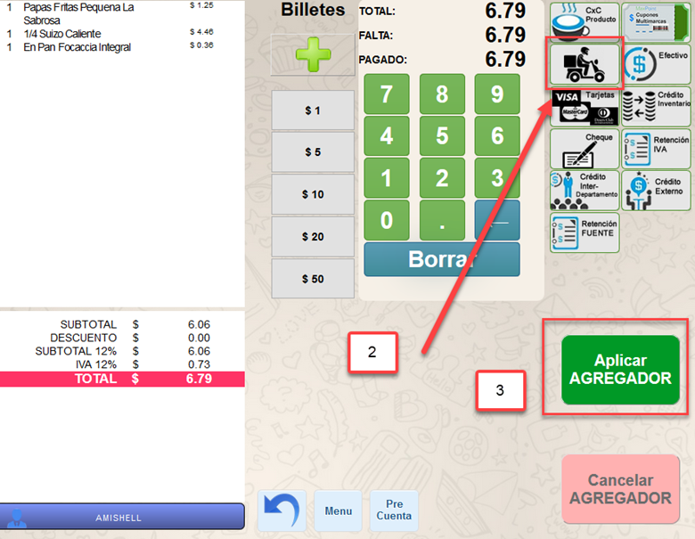
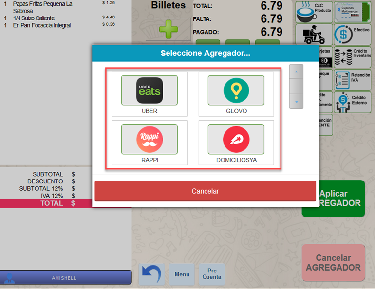
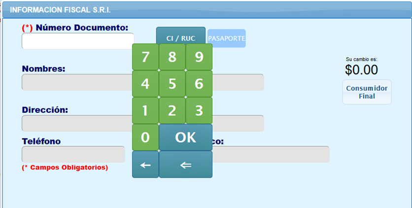
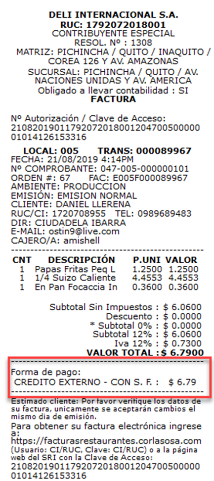
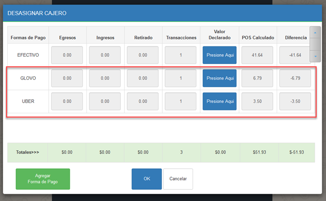
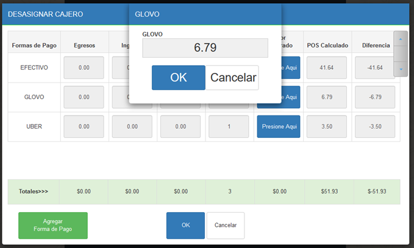
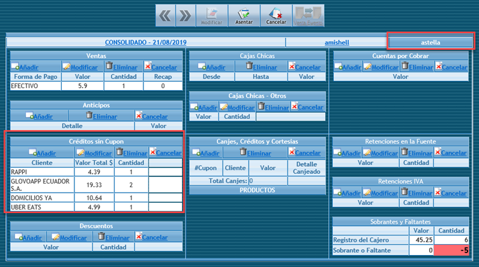

# CONFIGURACIÓN Uber Eats, Glovo, Etc.
## 1.	ANTECEDENTES
Actualmente en el sistema MaxPoint; existe una integración para realizar pedidos a través de la plataforma de entrega de comida llamada Uber Eats, ahora se requiere añadir otras plataformas como son: Glovo, etc.
## 2.	OBJETIVO GENERAL
Generar pedidos aplicando las formas de pago de las plataformas de entrega de comida.

2.1	Objetivos específicos

•	Crear políticas de configuración para formas de pago Uber Eats, Glovo, etc.

•	Crear un solo botón que contengas todas las formas de pago como agregadores.

## 3.	PUNTO DE VENTA FACTURACIÓN
Una vez aplicadas las configuraciones en la tienda, procedemos a realizar una verificación.

1.	Realizamos un pedido como ejemplo y pasamos a la pantalla de facturación.
2.	En la parte derecha debe aparecer la forma de pago que contiene a los agregadores con el nombre AGREGADOR.
3.	Seleccionamos el botón forma de pago AGREGADOR y lo aplicamos.

4.	Al aplicar debe visualizarse una modal que contiene todas las formas de pago establecidas como agregadores.

5.	Seleccionaos una de las formas de pago agregador y se debe visualizar un teclado virtual para ingresar el código emitido por la plataforma de entrega de comida como Uber, Glovo, etc.

6.	Presionamos OK y nos parecerá la pantalla para finalizar la transacción, aquí se debe ingresar los datos del cliente de ser necesario, caso contrario como consumidor final.

7.	En la factura impresa, la descripción de la forma de pago debe ser: **CREDITO EXTERNO – CON S.F**.

## 4.	DESMONTADO DE CAJERO/A
MaxPoint
1.	Ingresar a la pantalla desmontado de cajero.
2.	Retirar el fondo asignado.
3.	Presionar sobre el botón DESASIGNAR CAJERO.
4.	Aquí se visualizará una modal con las formas de pago que fueron aplicadas en las transacciones realizadas por el cajero/a incluyendo las establecidas como agregadores.

5.	Al declarar los valores las formas de pago como agregadores, estas no pueden ser modificadas.

6.	Realizar la declaración de valores para desmontar el cajero. 

SISTEMA GERENTE

Al desmontar el cajero y generar la interface de venta ingresamos al sistema gerente.
1.	Ingresar al restaurante.
2.	En el menú presionamos cierre de cajas y seleccionamos el cierre de la fecha del período en el cual se generó venta. 
3.	En el detalle de las formas de pago se debe subir los agregadores a la sección “Créditos Sin Cupón”

