# MANUAL DE CONFIGURACION PROCESO UBER
## 1.	OBJETIVOS
Conocer sobre las diferentes configuraciones que se deben realizar antes de poner en producción el desarrollo de uber para evitar inconvenientes en el proceso.

## 2	MANUAL CONFIGURACION PROCESO VITALITY. 
2.1	Datos Generales

En este manual se detalla las configuraciones que deben realizar en el backoffice de Maxpoint para que el proceso UBER funcione de la mejor manera correcta.

2.2	Configuración de politicas Backend MAXPOINT 

Para poder configurar las políticas de Maxpoint como primer punto debemos ingresar al backend. Para ello ingresamos al mantenimiento de MaxPoint con las credenciales y seleccionamos la cadena a la cual vamos a configurar. Una vez ingresada en a la cadena nos vamos a la opción SEGURIDADES y luego a la pestaña políticas.

2.2.1	Configuración de politicas Formas de Pago

Dentro de la pestaña políticas seleccionamos la opción Formas de pago, en la cual crearemos la colección REQUIERE CODIGO, para ello debemos pulsar sobre la opción .

y configurar de la siguiente manera:

Creada la colección, debemos dar clic sobre ella y se desplegará todos los parámetros disponibles. (En este caso como es nueva no tendrá parámetros creados) 

Terminado el proceso anterior debe aparecer de la siguiente forma la colección creada Continuando con el proceso, debemos crear parámetros asignando la colección creada. 

Dar clic sobre la opción

configuraremos de la siguiente manera:

Finalmente, si configuramos de manera correcta el parámetro debe visualizarse de la siguiente manera:

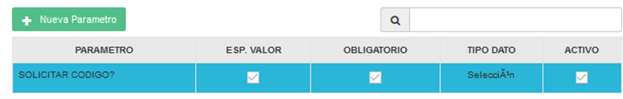

2.3	Creación de Política agregadores Información 
1.	Creación de política a nivel de cadena:

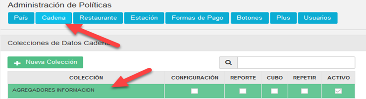

Parámetro UBER

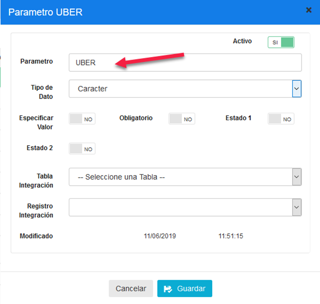

2.	Creación de política a nivel de cadena:

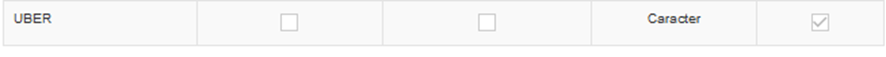

2.4	Creación de Politica Lista de agregadores y canales 

1.	Creación de política a nivel de cadena:

Revisar si se encuentra creada la política LISTA DE AGREGADORES Y CANALES, de no mantener creada la política crearla de la siguiente manera:

Dirigirse a la administración de politicas

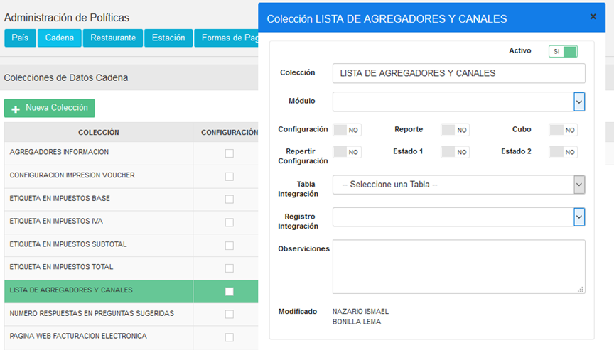

Crear el parámetro UBER

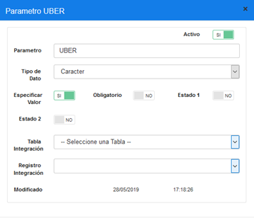

### Política por cadena 
1.	Configuración de política campo de Carácter con Información del RUC de Uber de Gerente.

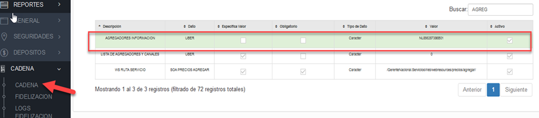

Se configura de la siguiente manera

RUC: NL856287386B01

Entero: 0

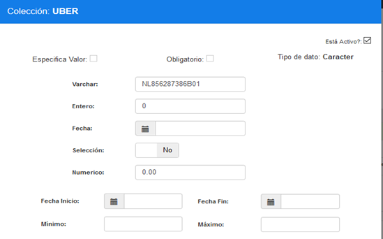

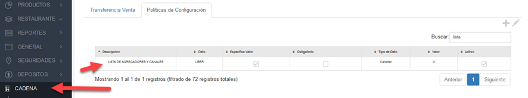

2.	Creación de parámetro de la política creada

3.	Configuración de política campo de selección Activo si es agregador o no.

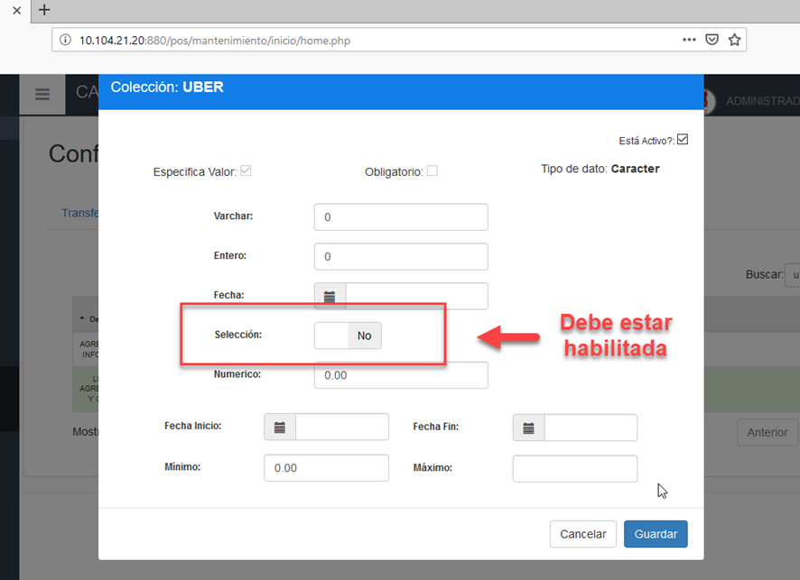

**Nota en Maxpoint:** Debe estar activado el campo de selección, ya que este proceso sirve para realizar interface.

2.5	Configuración de Políticas Formas Pago UBER

Como ya hemos acabado de configurar las políticas, es momento de darles un valor a las mismas para ello nos dirigimos a la pestaña **GENERAL** y seleccionaremos **FORMAS DE PAGO - DEFINICION**. 

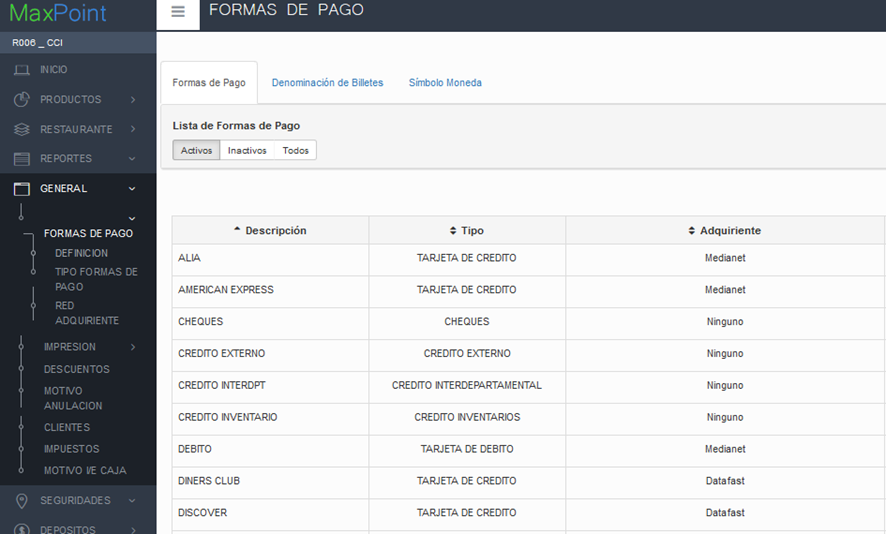

El sistema muestra todas las formas de pago creadas en una tabla. La forma de pago UBER no se aparece debido a que no se encuentra creada.

2.5.1	Craer Forma de Pago UBER

Para crear la forma de pago UBER debemos seguir los siguientes pasos:

1.	Acceder a la pestaña **GENERAL**, luego al submenú **FORMAS DE PAGO** e ingresar a la pantalla de **DEFINICION**.

2.	**IMPORTANTE: SE DEBE CREAR PRIMERO SOLO LA FORMA DE PAGO Y GUARDAR, DESPUES SE DEBE CONFIGURAR LAS POLITICAS YA QUE SI SE CONFIGURA TODO DARA ERROR DE REPLICA**.

3.	Agregar una nueva forma de pago en la opción.

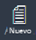

4.	Configurar la forma de pago UBER (Forma de Pago crédito externo) como la siguiente imagen:

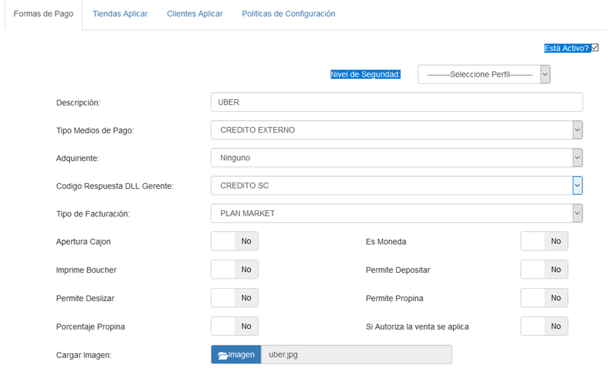

**Nota:** Se debe seleccionar en Código Respuesta DLL Gerente la opción que contenga el código de Crédito externo en el Sistema Gerente.

5.	Al crear la forma de pago se agregan de manera automática dos políticas de configuración (si no se crean, debemos crearlas).

a.	Requiere autorización – Se solicita para aplicar forma de Pago

b.	Visualizar forma de pago-se muestra en el punto de venta.

Nota:

* Si no se agregan de manera automática, debemos añadirlas.

* No debemos olvidarnos de agregar la política Requiere Código que hemos creado anteriormente y le damos un valor de selección.

* Al terminar la configuración se debe verificar que la forma de pago se vea de la siguiente manera:

**No se aplicará ningún cambio en “TIENDAS A APLICAR”**

**No se aplicará ningún cambio en “CLIENTES APLICAR”**

Crearemos las políticas de configuración:

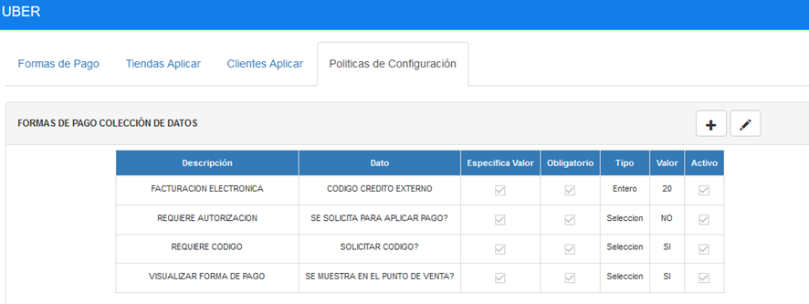

Si no bajan automáticamente las crearemos manualmente 

Colocar los datos como se muestra en las imágenes

FACTURACION ELECTRONICA

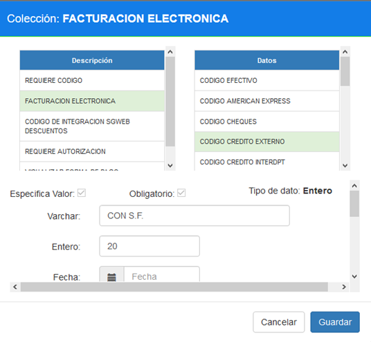

REQUIERE AUTORIZACION

Escoger Bit: NO

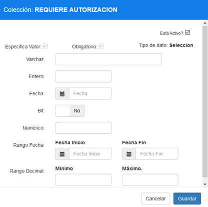

REQUIERE CODIGO

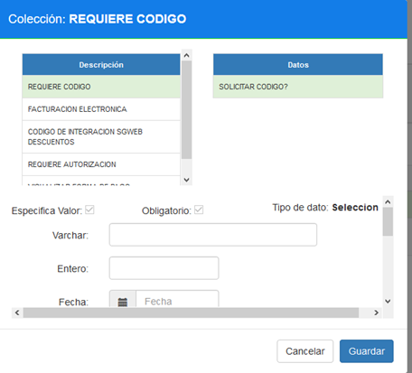

VISUALIZAR FORMA DE PAGO

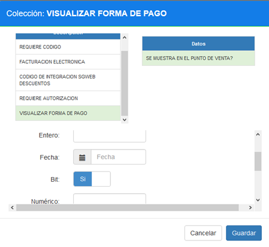

Nos dirigimos a RESTAURANTE Y ESCOJEMOS EL LOCAL AL QUE VAMOS A CONFIGURAR

Ingresamos a Políticas de Configuración

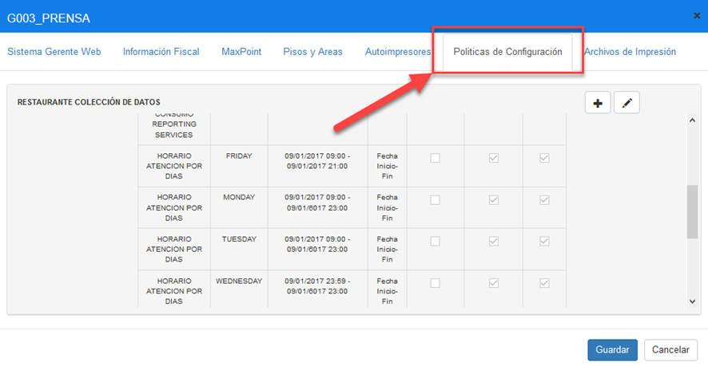

se debe configurar las políticas de restaurante:
1.	**impresión ficha – etiqueta de impresión en orden - ORDEN:**
2.	**impresión orden pedido-solicitar información inicio**
3.	**impresión orden pedido-imprime orden?**

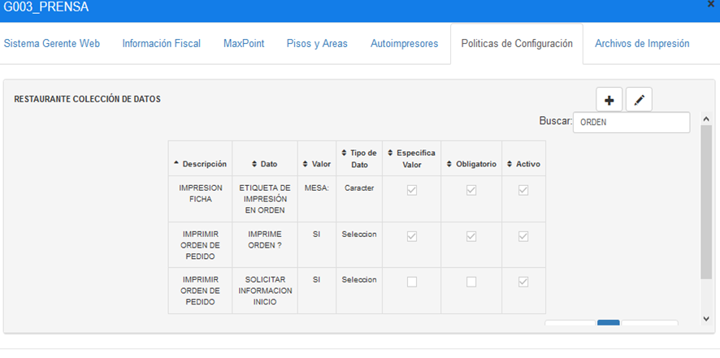

AGREGAMOS IMPRESIÓN FICHA

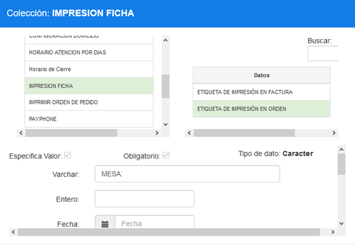

AGREGAMOS IMPRIMIR ORDEN DE PEDIDO

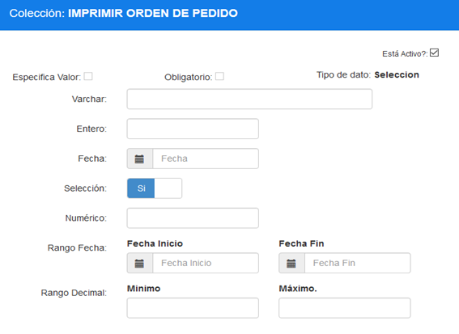

NOS DIRIGIMOS A CONFIGURAR LAS MESAS 

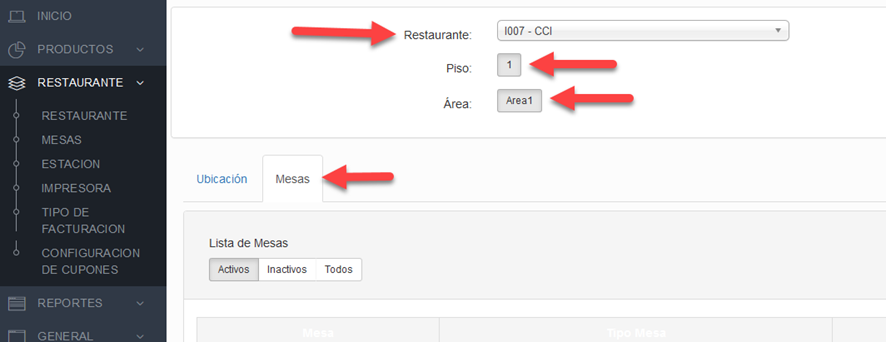

Creamos una nueva mesa Y LA CONFIGURAMOS COMO EN LA IMAGEN

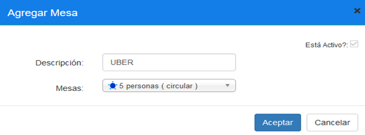

MOSTRARA UN ERROR Y LE DAMOS EN ACEPTAR

MOSTRARA UN ERROR Y LE DAMOS EN ACEPTAR

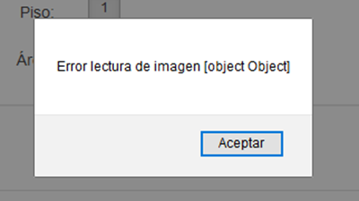