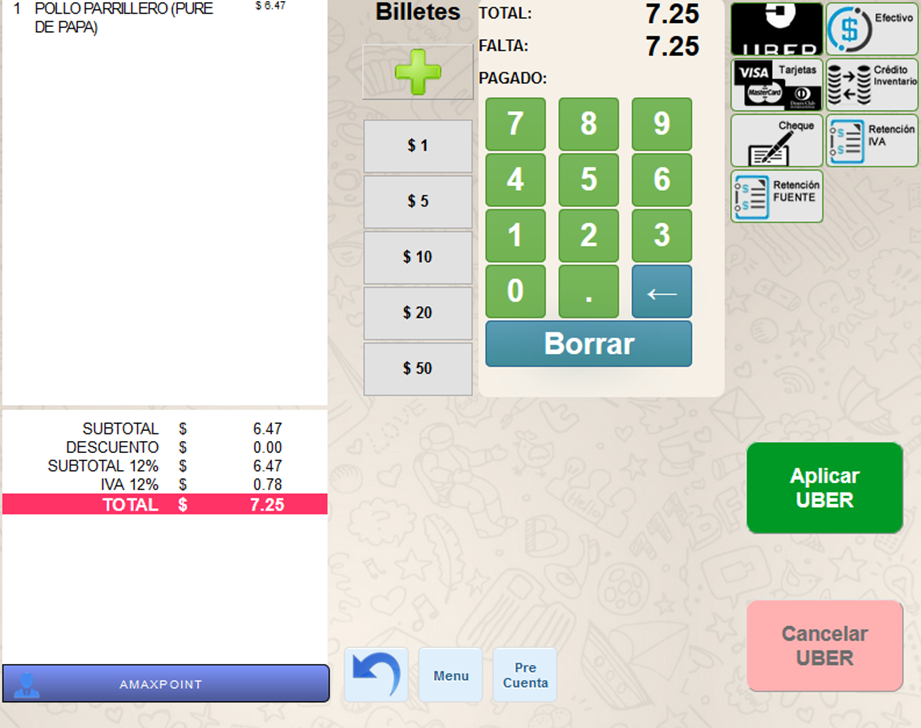
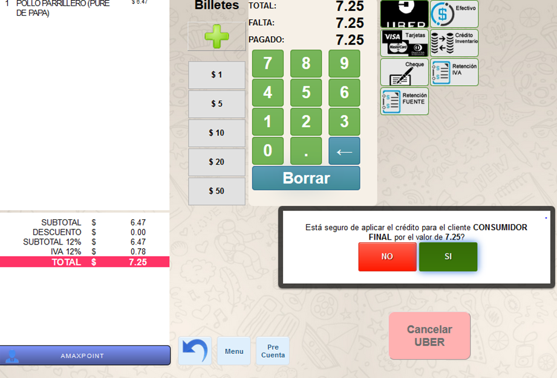

# MANUAL DE USUARIO UBER
## 1.	OBJETIVOS

Conocer sobre el funcionamiento y el proceso que se debe seguir al momento de realizar ventas con UBER.

## 2.	MANUAL USUARIO PROCESO VITALITY. 

2.1	Datos Generales

En este manual se detalla el funcionamiento de al realizar ventas con forma de pago UBER en el POS de Maxpoint.

2.2	Pantalla Inicio y Orden de Pedido MAXPOINT POS

Al ingresar al sistema Maxpoint POS siguiendo el flujo normal de logo de cajero, el usuario del sistema tomará la orden de pedido normalmente.

Una vez realizada la toma de pedido el cajero llega a la pantalla de facturación en la cual si la forma de pago es UBER tendremos lo siguiente:

2.3	Pantalla Facturación UBER 

En la pantalla de facturación se muestran todas las formas de pago configuradas, en la cual, si la venta que se va a realizar es de UBER, debemos seleccionar esta opción.

Al seleccionar la opción **UBER** mencionada anteriormente, el sistema mostrara los botones Aplicar y Cancelar. (dependiendo de la forma de Pago)

Aplicamos la forma de pago UBER; el sistema muestra una pantalla como la imagen a continuación, en la cual debemos insertar el código proporcionado por la aplicación.  

Realizada la parte de facturación y el proceso se realice correctamente, el sistema imprimirá la respectiva factura, en la cual podremos visualizar que la forma de pago es UBER.